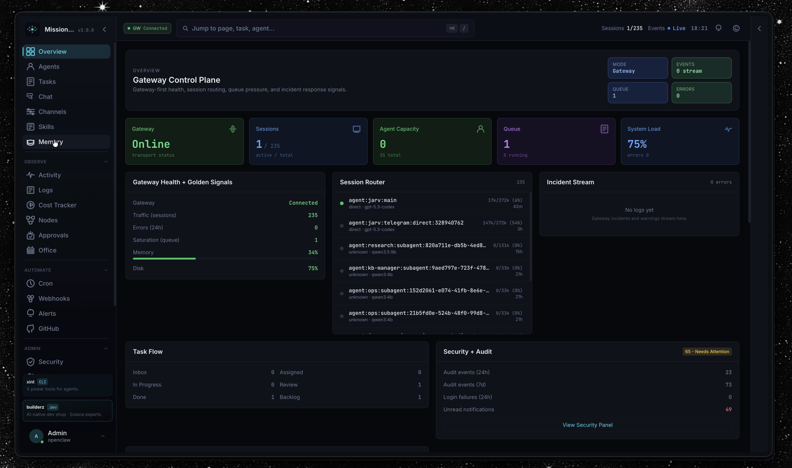
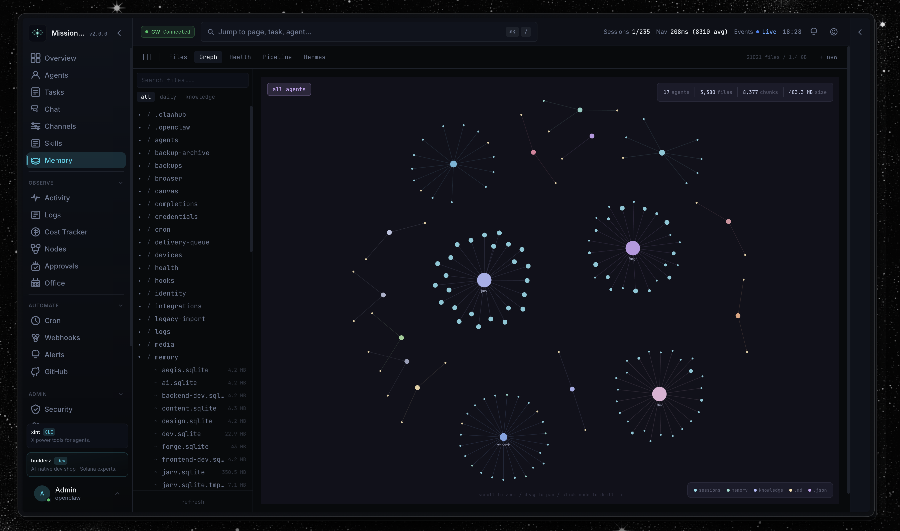

<div align="center">

# Mission Control

**The open-source dashboard for AI agent orchestration.**

Manage agent fleets, track tasks, monitor costs, and orchestrate workflows — all from a single pane of glass.

[](LICENSE)
[](https://nextjs.org/)
[](https://react.dev/)
[](https://typescriptlang.org/)
[](https://sqlite.org/)



</div>

---

> **Alpha Software** — Mission Control is under active development. APIs, database schemas, and configuration formats may change between releases. Review the [known limitations](#known-limitations) and [security considerations](#security-considerations) before deploying to production.

## Why Mission Control?

Running AI agents at scale means juggling sessions, tasks, costs, and reliability across multiple models and channels. Mission Control gives you:

- **32 panels** — Tasks, agents, skills, logs, tokens, memory, security, cron, alerts, webhooks, pipelines, and more
- **Real-time everything** — WebSocket + SSE push updates, smart polling that pauses when you're away
- **Zero external dependencies** — SQLite database, single `pnpm start` to run, no Redis/Postgres/Docker required
- **Role-based access** — Viewer, operator, and admin roles with session + API key auth
- **Quality gates** — Built-in Aegis review system that blocks task completion without sign-off
- **Recurring tasks** — Natural language scheduling ("every morning at 9am") with cron-based template spawning
- **Claude Code bridge** — Read-only integration surfaces Claude Code team tasks and configs on the dashboard
- **Skills Hub** — Browse, install, and security-scan agent skills from ClawdHub and skills.sh registries
- **Multi-gateway** — Connect to multiple agent gateways simultaneously (OpenClaw, and more coming soon)

## Quick Start

### One-Command Install (Docker)

```bash
git clone https://github.com/builderz-labs/mission-control.git
cd mission-control
bash install.sh --docker
```

The installer auto-generates secure credentials, starts the container, and runs an OpenClaw fleet health check. Open `http://localhost:3000` to create your admin account.

### One-Command Install (Local)

```bash
git clone https://github.com/builderz-labs/mission-control.git
cd mission-control
bash install.sh --local
```

Requires Node.js 22.x (LTS, recommended) or 24.x, and pnpm (auto-installed via corepack if missing).

### One-Command Install (Windows PowerShell)

```powershell
git clone https://github.com/builderz-labs/mission-control.git
cd mission-control
.\install.ps1 -Mode local
```

Or with Docker:

```powershell
.\install.ps1 -Mode docker
```

Additional options: `-Port 8080`, `-SkipOpenClaw`. Requires Node.js 22+ and pnpm (auto-installed via corepack if missing).

### Manual Setup

> **Requires [pnpm](https://pnpm.io/installation)** and **Node.js 22.x (LTS, recommended) or 24.x**.
> Mission Control is validated on Node 22 (primary CI/LTS) and supports Node 24 for local dev and deploys. Use `nvm use 22` (or `nvm use 24`) before installing or starting the app.

```bash
git clone https://github.com/builderz-labs/mission-control.git
cd mission-control
nvm use 22            # or: nvm use 24
pnpm install
pnpm dev                # http://localhost:3000/setup
```

On first run, visit `http://localhost:3000/setup` to create your admin account. Secrets (`AUTH_SECRET`, `API_KEY`) are auto-generated and persisted to `.data/`.

For CI/automation, set `AUTH_USER` and `AUTH_PASS` env vars to seed the admin from environment instead.

## Gateway Optional Mode (Standalone Deployment)

Mission Control can run in standalone mode without a gateway connection. This is useful when:

- Deploying on a VPS with firewall rules blocking non-standard WebSocket ports (18789/18790)
- Testing UI/core workflows without a running gateway
- Running Mission Control primarily for project/task operations

Enable with:

```bash
NEXT_PUBLIC_GATEWAY_OPTIONAL=true
```

When enabled, the HUD status shows `Gateway Optional (Standalone)` instead of `Disconnected`.

Works without gateway:
- Task board, projects, agents, sessions, scheduler, webhooks, alerts, activity/audit, cost tracking

Requires active gateway:
- Real-time session updates
- Agent-to-agent messaging
- Gateway log streaming

For production VPS setups, you can also proxy gateway WebSockets over 443. See `docs/deployment.md`.

### Docker Zero-Config

```bash
docker compose up
```

No `.env` file needed. The container auto-generates `AUTH_SECRET` and `API_KEY` on first boot and persists them across restarts. Visit `http://localhost:3000` to create your admin account.

### Docker Hardening (Production)

For production deployments, use the hardened compose overlay:

```bash
docker compose -f docker-compose.yml -f docker-compose.hardened.yml up -d
```

This adds read-only filesystem, capability dropping, log rotation, HSTS, and network isolation. See [Security Hardening](docs/SECURITY-HARDENING.md) for the full checklist.

### Station Doctor

Run diagnostics on your installation:

```bash
bash scripts/station-doctor.sh
bash scripts/security-audit.sh
```

## Project Status

### What Works

- Agent management with full lifecycle (register, heartbeat, wake, retire)
- Kanban task board with drag-and-drop, priorities, assignments, and comments
- Real-time monitoring via WebSocket + SSE with smart polling
- Token usage and cost tracking with per-model breakdowns
- Multi-gateway connection management
- Role-based access control (viewer, operator, admin)
- Background scheduler for automated tasks
- Outbound webhooks with delivery history, retry with exponential backoff, and circuit breaker
- Webhook signature verification (HMAC-SHA256 with constant-time comparison)
- Local Claude Code session tracking (auto-discovers from `~/.claude/projects/`)
- Quality review gates for task sign-off
- Pipeline orchestration with workflow templates
- Ed25519 device identity for secure gateway handshake
- Agent SOUL system with workspace file sync and templates
- Agent inter-agent messaging and comms
- Skills Hub with ClawdHub and skills.sh registry integration (search, install, security scan)
- Bidirectional skill sync — disk ↔ DB with SHA-256 change detection
- Local agent discovery from `~/.agents/`, `~/.codex/agents/`, `~/.claude/agents/`
- Natural language recurring tasks — schedule parser converts "every 2 hours" to cron, spawns dated child tasks
- Claude Code task bridge — read-only scanner surfaces team tasks and configs from `~/.claude/tasks/` and `~/.claude/teams/`
- Skill security scanner (prompt injection, credential leaks, data exfiltration, obfuscated content)
- Update available banner with GitHub release check and one-click self-update
- Framework adapter layer for multi-agent registration (OpenClaw, CrewAI, LangGraph, AutoGen, Claude SDK, generic)
- Multi-project task organization with per-project ticket prefixes
- Per-agent rate limiting with `x-agent-name` identity-based quotas
- Agent self-registration endpoint for autonomous agent onboarding
- Security audit panel with posture scoring, secret detection, trust scoring, and MCP call auditing
- Four-layer agent eval framework (output, trace, component, drift detection)
- Agent optimization endpoint with token efficiency, tool patterns, and fleet benchmarks
- Hook profiles (minimal/standard/strict) for tunable security strictness
- Guided onboarding wizard with credential setup, agent discovery, and security scan

### Known Limitations

- No major security limitations currently tracked here for CSP; policy now uses per-request nonces (no `unsafe-inline` / `unsafe-eval`).

### Security Considerations

- **Change all default credentials** (`AUTH_USER`, `AUTH_PASS`, `API_KEY`) before deploying
- **Deploy behind a reverse proxy with TLS** (e.g., Caddy, nginx) for any network-accessible deployment
- **Review [SECURITY.md](SECURITY.md)** for the vulnerability reporting process
- **Do not expose the dashboard to the public internet** without configuring `MC_ALLOWED_HOSTS` and TLS

## Features

### Agent Management
Monitor agent status, configure models, view heartbeats, and manage the full agent lifecycle from registration to retirement. Agent detail modal with compact overview, inline model selector, and editable sub-agent configuration.



### Task Board
Kanban board with six columns (inbox → assigned → in progress → review → quality review → done), drag-and-drop, priority levels, assignments, threaded comments, and inline sub-agent spawning.

### Real-time Monitoring
Live activity feed, session inspector, and log viewer with filtering. WebSocket connection to OpenClaw gateway for instant event delivery.

### Cost Tracking
Token usage dashboard with per-model breakdowns, trend charts, and cost analysis powered by Recharts.

### Background Automation
Scheduled tasks for database backups, stale record cleanup, agent heartbeat monitoring, and recurring task spawning. Configurable via UI or API.

### Natural Language Recurring Tasks
Create recurring tasks with natural language like "every morning at 9am" or "every 2 hours". The built-in schedule parser (zero dependencies) converts expressions to cron and stores them in task metadata. A template-clone pattern keeps the original task as a template and spawns dated child tasks (e.g., "Daily Report - Mar 07") on schedule. Each spawned task gets its own Aegis quality gate.

### Direct CLI Integration
Connect Claude Code, Codex, or any CLI tool directly to Mission Control without requiring a gateway. Register connections, send heartbeats with inline token reporting, and auto-register agents.

### Claude Code Session Tracking
Automatically discovers and tracks local Claude Code sessions by scanning `~/.claude/projects/`. Extracts token usage, model info, message counts, cost estimates, and active status from JSONL transcripts. Scans every 60 seconds via the background scheduler.

### Claude Code Task Bridge
Read-only integration that surfaces Claude Code team tasks and team configs on the Mission Control dashboard. Scans `~/.claude/tasks/<team>/<N>.json` for structured task data (subject, status, owner, blockers) and `~/.claude/teams/<name>/config.json` for team metadata (members, lead agent, model assignments). Visible in both the Task Board (collapsible section) and Cron Management (teams overview) panels.

### GitHub Issues Sync
Inbound sync from GitHub repositories with label and assignee mapping. Synced issues appear on the task board alongside agent-created tasks.

### Skills Hub
Browse, install, and manage agent skills from local directories and external registries (ClawdHub, skills.sh). Bidirectional sync detects manual additions on disk and pushes UI edits back to `SKILL.md` files. Built-in security scanner checks for prompt injection, credential leaks, data exfiltration, obfuscated content, and dangerous shell commands before installation. Supports 5 skill roots: `~/.agents/skills`, `~/.codex/skills`, project-local `.agents/skills` and `.codex/skills`, and `~/.openclaw/skills` for gateway mode.

### Local Agent Discovery
Automatically discovers agent definitions from `~/.agents/`, `~/.codex/agents/`, and `~/.claude/agents/` directories. Detection looks for marker files (AGENT.md, soul.md, identity.md, config.json). Discovered agents sync bidirectionally — edit in the UI and changes write back to disk.

### Agent SOUL System
Define agent personality, capabilities, and behavioral guidelines via SOUL markdown files. Edit in the UI or directly in workspace `soul.md` files — changes sync bidirectionally between disk and database.

### Agent Messaging
Session-threaded inter-agent communication via the comms API (`a2a:*`, `coord:*`, `session:*`) with coordinator inbox support and runtime tool-call visibility in the `agent-comms` feed.

### Memory Knowledge Graph
Explore agent knowledge through the Memory Browser, filesystem-backed memory tree, and interactive relationship graph for sessions, memory chunks, and linked knowledge files.


### Onboarding Wizard
Guided first-run setup wizard that walks new users through five steps: Welcome (system capabilities detection), Credentials (verify AUTH_PASS and API_KEY strength), Agent Setup (gateway connection or local Claude Code discovery), Security Scan (automated configuration audit with pass/fail checks), and Get Started (quick links to key panels). Automatically appears on first login and can be re-launched from Settings. Progress is persisted per-user so you can resume where you left off.

### Security Audit & Agent Trust
Dedicated security audit panel with real-time posture scoring (0-100), secret detection across agent messages, MCP tool call auditing, injection attempt tracking, and per-agent trust scores. Hook profiles (minimal/standard/strict) let operators tune security strictness per deployment. Auth failures, rate limit hits, and injection attempts are logged automatically as security events.

### Agent Eval Framework
Four-layer evaluation stack for agent quality: output evals (task completion scoring against golden datasets), trace evals (convergence scoring — >3.0 indicates looping), component evals (tool reliability with p50/p95/p99 latency from MCP call logs), and drift detection (10% threshold vs 4-week rolling baseline). Manage golden datasets and trigger eval runs via API or UI.

### Agent Optimization
API endpoint agents can call for self-improvement recommendations. Analyzes token efficiency (tokens/task vs fleet average), tool usage patterns (success/failure rates, redundant calls), and generates prioritized recommendations. Fleet benchmarks provide percentile rankings across all agents.

### Integrations
Outbound webhooks with delivery history, configurable alert rules with cooldowns, and multi-gateway connection management. Optional 1Password CLI integration for secret management.

### Workspace Management
Workspaces (tenant instances) are managed via the `/api/super/*` API endpoints. Admins can:
- **Create** new client instances (slug, display name, Linux user, gateway port, plan tier)
- **Monitor** provisioning jobs and their step-by-step progress
- **Decommission** tenants with optional cleanup of state directories and Linux users

Each workspace gets its own isolated environment with a dedicated OpenClaw gateway, state directory, and workspace root.

### Update Checker
Automatic GitHub release check notifies you when a new version is available, displayed as a banner in the dashboard. Admins can trigger a one-click update directly from the banner — the server runs `git pull`, `pnpm install`, and `pnpm build`, then prompts for a restart. Dirty working trees are rejected, and all updates are logged to the audit trail.

### Framework Adapters
Built-in adapter layer for multi-agent registration across frameworks. Supported adapters: OpenClaw, CrewAI, LangGraph, AutoGen, Claude SDK, and a generic fallback. Each adapter normalizes agent registration, heartbeats, and task reporting to a common interface.

## Architecture

```
mission-control/
├── src/
│   ├── proxy.ts               # Auth gate + CSRF + network access control
│   ├── app/
│   │   ├── page.tsx           # SPA shell — routes all panels
│   │   ├── login/page.tsx     # Login page
│   │   └── api/               # 101 REST API routes
│   ├── components/
│   │   ├── layout/            # NavRail, HeaderBar, LiveFeed
│   │   ├── dashboard/         # Overview dashboard
│   │   ├── panels/            # 32 feature panels
│   │   └── chat/              # Agent chat UI
│   ├── lib/
│   │   ├── auth.ts            # Session + API key auth, RBAC
│   │   ├── db.ts              # SQLite (better-sqlite3, WAL mode)
│   │   ├── claude-sessions.ts  # Local Claude Code session scanner
│   │   ├── claude-tasks.ts     # Claude Code team task/config scanner
│   │   ├── schedule-parser.ts  # Natural language → cron expression parser
│   │   ├── recurring-tasks.ts  # Recurring task template spawner
│   │   ├── migrations.ts      # 39 schema migrations
│   │   ├── scheduler.ts       # Background task scheduler
│   │   ├── webhooks.ts        # Outbound webhook delivery
│   │   ├── websocket.ts       # Gateway WebSocket client
│   │   ├── device-identity.ts # Ed25519 device identity for gateway auth
│   │   ├── agent-sync.ts      # OpenClaw config → MC database sync
│   │   ├── skill-sync.ts      # Bidirectional disk ↔ DB skill sync
│   │   ├── skill-registry.ts  # ClawdHub + skills.sh registry client & security scanner
│   │   ├── local-agent-sync.ts # Local agent discovery from ~/.agents, ~/.codex, ~/.claude
│   │   ├── secret-scanner.ts   # Regex-based secret detection (AWS, GitHub, Stripe, JWT, PEM, DB URIs)
│   │   ├── security-events.ts  # Security event logger + agent trust scoring
│   │   ├── mcp-audit.ts        # MCP tool call auditing
│   │   ├── agent-evals.ts      # Four-layer agent eval framework
│   │   ├── agent-optimizer.ts  # Agent optimization engine
│   │   ├── hook-profiles.ts    # Security strictness profiles (minimal/standard/strict)
│   │   └── adapters/          # Framework adapters (openclaw, crewai, langgraph, autogen, claude-sdk, generic)
│   └── store/index.ts         # Zustand state management
└── .data/                     # Runtime data (SQLite DB, token logs)
```

## Tech Stack

| Layer | Technology |
|-------|------------|
| Framework | Next.js 16 (App Router) |
| UI | React 19, Tailwind CSS 3.4 |
| Language | TypeScript 5.7 |
| Database | SQLite via better-sqlite3 (WAL mode) |
| State | Zustand 5 |
| Charts | Recharts 3 |
| Real-time | WebSocket + Server-Sent Events |
| Auth | scrypt hashing, session tokens, RBAC |
| Validation | Zod 4 |
| Testing | Vitest (282 unit) + Playwright (295 E2E) |

## Authentication

Three auth methods, three roles:

| Method | Details |
|--------|----------|
| Session cookie | `POST /api/auth/login` sets `__Host-mc-session` (7-day expiry) for HTTPS, `mc-session` for HTTP |
| API key | `x-api-key` header matches `API_KEY` env var |
| Google Sign-In | OAuth with admin approval workflow |

| Role | Access |
|------|--------|
| `viewer` | Read-only |
| `operator` | Read + write (tasks, agents, chat) |
| `admin` | Full access (users, settings, system ops) |

## API Reference

All endpoints require authentication unless noted. Full reference below.

<details>
<summary><strong>Auth</strong></summary>

| Method | Path | Description |
|--------|------|-------------|
| `POST` | `/api/auth/login` | Login with username/password |
| `POST` | `/api/auth/google` | Google Sign-In |
| `POST` | `/api/auth/logout` | Destroy session |
| `GET` | `/api/auth/me` | Current user info |
| `GET` | `/api/auth/access-requests` | List pending access requests (admin) |
| `POST` | `/api/auth/access-requests` | Approve/reject requests (admin) |

</details>

<details>
<summary><strong>Core Resources</strong></summary>

| Method | Path | Role | Description |
|--------|------|------|-------------|
| `GET` | `/api/agents` | viewer | List agents with task stats |
| `POST` | `/api/agents` | operator | Register/update agent |
| `GET` | `/api/agents/[id]` | viewer | Agent details |
| `GET` | `/api/agents/[id]/attribution` | viewer | Self-scope attribution/audit/cost report (`?privileged=1` admin override) |
| `POST` | `/api/agents/sync` | operator | Sync agents from openclaw.json or local disk (`?source=local`) |
| `POST` | `/api/agents/register` | viewer | Agent self-registration (idempotent, rate-limited) |
| `GET/POST` | `/api/adapters` | viewer/operator | List adapters / Framework-agnostic agent action dispatch |
| `GET/PUT` | `/api/agents/[id]/soul` | operator | Agent SOUL content (reads from workspace, writes to both) |
| `GET/POST` | `/api/agents/comms` | operator | Agent inter-agent communication |
| `POST` | `/api/agents/message` | operator | Send message to agent |
| `GET` | `/api/tasks` | viewer | List tasks (filter: `?status=`, `?assigned_to=`, `?priority=`) |
| `POST` | `/api/tasks` | operator | Create task |
| `GET` | `/api/tasks/queue` | operator | Poll next task for an agent (`?agent=`, optional `?max_capacity=`) |
| `GET` | `/api/tasks/[id]` | viewer | Task details |
| `PUT` | `/api/tasks/[id]` | operator | Update task |
| `DELETE` | `/api/tasks/[id]` | admin | Delete task |
| `GET` | `/api/tasks/[id]/comments` | viewer | Task comments |
| `POST` | `/api/tasks/[id]/comments` | operator | Add comment |
| `POST` | `/api/tasks/[id]/broadcast` | operator | Broadcast task to agents |

</details>

### Attribution Contract (`/api/agents/[id]/attribution`)

- Self-scope by default: requester identity must match target agent via `x-agent-name` (or matching authenticated username).
- Admin override requires explicit `?privileged=1`.
- Query params:
  - `hours`: integer window `1..720` (default `24`)
  - `section`: comma-separated subset of `identity,audit,mutations,cost` (default all)

<details>
<summary><strong>Security & Evals</strong></summary>

| Method | Path | Role | Description |
|--------|------|------|-------------|
| `GET` | `/api/security-audit` | admin | Security posture, events, trust scores, MCP audit (`?timeframe=day`) |
| `GET` | `/api/security-scan` | admin | Static security configuration scan |
| `GET` | `/api/agents/optimize` | operator | Agent optimization recommendations (`?agent=&hours=24`) |
| `GET` | `/api/agents/evals` | operator | Agent eval results (`?agent=`, `?action=history&weeks=4`) |
| `POST` | `/api/agents/evals` | operator | Trigger eval run (`action: 'run'`) or manage golden datasets (`action: 'golden-set'`) |

</details>

<details>
<summary><strong>Monitoring</strong></summary>

| Method | Path | Role | Description |
|--------|------|------|-------------|
| `GET` | `/api/status` | viewer | System status (uptime, memory, disk) |
| `GET` | `/api/activities` | viewer | Activity feed |
| `GET` | `/api/notifications` | viewer | Notifications for recipient |
| `GET` | `/api/sessions` | viewer | Active gateway sessions |
| `GET` | `/api/tokens` | viewer | Token usage and cost data |
| `GET` | `/api/standup` | viewer | Standup report history |
| `POST` | `/api/standup` | operator | Generate standup |
| `GET` | `/api/releases/check` | viewer | Check for new GitHub releases |

</details>

<details>
<summary><strong>Configuration</strong></summary>

| Method | Path | Role | Description |
|--------|------|------|-------------|
| `GET/PUT` | `/api/settings` | admin | App settings |
| `GET/PUT` | `/api/gateway-config` | admin | OpenClaw gateway config |
| `GET/POST` | `/api/cron` | admin | Cron management |
| `GET/POST` | `/api/onboarding` | viewer | Onboarding wizard state and step progression |

</details>

<details>
<summary><strong>Operations</strong></summary>

| Method | Path | Role | Description |
|--------|------|------|-------------|
| `GET/POST` | `/api/scheduler` | admin | Background task scheduler |
| `GET` | `/api/audit` | admin | Audit log |
| `GET` | `/api/logs` | viewer | Agent log browser |
| `GET` | `/api/memory` | viewer | Memory file browser/search |
| `GET` | `/api/search` | viewer | Global search |
| `GET` | `/api/export` | admin | CSV export |
| `POST` | `/api/backup` | admin | Database backup |
| `POST` | `/api/cleanup` | admin | Stale data cleanup |

</details>

<details>
<summary><strong>Integrations</strong></summary>

| Method | Path | Role | Description |
|--------|------|------|-------------|
| `GET/POST/PUT/DELETE` | `/api/webhooks` | admin | Webhook CRUD |
| `POST` | `/api/webhooks/test` | admin | Test delivery |
| `POST` | `/api/webhooks/retry` | admin | Manual retry a failed delivery |
| `GET` | `/api/webhooks/verify-docs` | viewer | Signature verification docs |
| `GET` | `/api/webhooks/deliveries` | admin | Delivery history |
| `GET/POST/PUT/DELETE` | `/api/alerts` | admin | Alert rules |
| `GET/POST/PUT/DELETE` | `/api/gateways` | admin | Gateway connections |
| `POST` | `/api/gateways/connect` | operator | Resolve websocket URL + token for selected gateway |
| `GET/PUT/DELETE/POST` | `/api/integrations` | admin | Integration management |
| `POST` | `/api/github` | admin | Trigger GitHub Issues sync |

</details>

<details>
<summary><strong>Workspace/Tenant Management</strong></summary>

| Method | Path | Role | Description |
|--------|------|------|-------------|
| `GET` | `/api/super/tenants` | admin | List all tenants with latest provisioning status |
| `POST` | `/api/super/tenants` | admin | Create tenant and queue bootstrap job |
| `POST` | `/api/super/tenants/[id]/decommission` | admin | Queue tenant decommission job |
| `GET` | `/api/super/provision-jobs` | admin | List provisioning jobs (filter: `?tenant_id=`, `?status=`) |
| `POST` | `/api/super/provision-jobs` | admin | Queue additional job for existing tenant |
| `POST` | `/api/super/provision-jobs/[id]/action` | admin | Approve, reject, or cancel a provisioning job |

</details>

<details>
<summary><strong>Skills</strong></summary>

| Method | Path | Role | Description |
|--------|------|------|-------------|
| `GET` | `/api/skills` | viewer | List skills (DB-backed with filesystem fallback) |
| `GET` | `/api/skills?mode=content&source=…&name=…` | viewer | Read SKILL.md content with inline security report |
| `GET` | `/api/skills?mode=check&source=…&name=…` | viewer | On-demand security scan |
| `POST` | `/api/skills` | operator | Create skill |
| `PUT` | `/api/skills` | operator | Update skill content |
| `DELETE` | `/api/skills` | operator | Delete skill |
| `GET` | `/api/skills/registry?source=…&q=…` | viewer | Search external registry (ClawdHub, skills.sh) |
| `POST` | `/api/skills/registry` | admin | Install skill from registry |
| `PUT` | `/api/skills/registry` | viewer | Security-check content without installing |

</details>

<details>
<summary><strong>Direct CLI</strong></summary>

| Method | Path | Role | Description |
|--------|------|------|-------------|
| `POST` | `/api/connect` | operator | Register direct CLI connection |
| `GET` | `/api/connect` | viewer | List active connections |
| `DELETE` | `/api/connect` | operator | Disconnect CLI session |

</details>

<details>
<summary><strong>Chat & Real-time</strong></summary>

| Method | Path | Description |
|--------|------|-------------|
| `GET` | `/api/events` | SSE stream of DB changes |
| `GET/POST` | `/api/chat/conversations` | Conversation CRUD |
| `GET/POST` | `/api/chat/messages` | Message CRUD |

</details>

<details>
<summary><strong>Agent Lifecycle</strong></summary>

| Method | Path | Role | Description |
|--------|------|------|-------------|
| `POST` | `/api/spawn` | operator | Spawn agent session |
| `POST` | `/api/agents/[id]/heartbeat` | operator | Agent heartbeat |
| `POST` | `/api/agents/[id]/wake` | operator | Wake sleeping agent |
| `POST` | `/api/quality-review` | operator | Submit quality review |

</details>

<details>
<summary><strong>Claude Code Sessions</strong></summary>

| Method | Path | Role | Description |
|--------|------|------|-------------|
| `GET` | `/api/claude/sessions` | viewer | List discovered sessions (filter: `?active=1`, `?project=`) |
| `POST` | `/api/claude/sessions` | operator | Trigger manual session scan |
| `GET` | `/api/claude-tasks` | viewer | List Claude Code team tasks and configs (`?force=true` to bypass cache) |
| `GET` | `/api/schedule-parse` | viewer | Parse natural language schedule (`?input=every+2+hours`) |

</details>

<details>
<summary><strong>Pipelines</strong></summary>

| Method | Path | Role | Description |
|--------|------|------|-------------|
| `GET` | `/api/pipelines` | viewer | List pipeline runs |
| `POST` | `/api/pipelines/run` | operator | Start pipeline |
| `GET/POST` | `/api/workflows` | viewer/admin | Workflow templates |

</details>

## Environment Variables

See [`.env.example`](.env.example) for the complete list. Key variables:

| Variable | Required | Description |
|----------|----------|-------------|
| `AUTH_USER` | No | Initial admin username (default: `admin`) |
| `AUTH_PASS` | No | Initial admin password |
| `AUTH_PASS_B64` | No | Base64-encoded admin password (overrides `AUTH_PASS` if set) |
| `API_KEY` | No | API key for headless access |
| `OPENCLAW_CONFIG_PATH` | Yes* | Absolute path to `openclaw.json` (preferred) |
| `OPENCLAW_STATE_DIR` | Yes* | OpenClaw state root (default: `~/.openclaw`) |
| `OPENCLAW_HOME` | No | Legacy alias for state dir (fallback if `OPENCLAW_STATE_DIR` unset) |
| `OPENCLAW_GATEWAY_HOST` | No | Gateway host (default: `127.0.0.1`) |
| `OPENCLAW_GATEWAY_PORT` | No | Gateway WebSocket port (default: `18789`) |
| `OPENCLAW_GATEWAY_TOKEN` | No | Server-side gateway auth token |
| `OPENCLAW_TOOLS_PROFILE` | No | Tools profile for `sessions_spawn` (recommended: `coding`) |
| `NEXT_PUBLIC_GATEWAY_TOKEN` | No | Browser-side gateway auth token (must use `NEXT_PUBLIC_` prefix) |
| `NEXT_PUBLIC_GATEWAY_CLIENT_ID` | No | Gateway UI client ID for websocket handshake (default: `openclaw-control-ui`) |
| `OPENCLAW_MEMORY_DIR` | No | Memory browser root (see note below) |
| `MC_CLAUDE_HOME` | No | Path to `~/.claude` directory (default: `~/.claude`) |
| `MC_TRUSTED_PROXIES` | No | Comma-separated trusted proxy IPs for XFF parsing |
| `MC_ALLOWED_HOSTS` | No | Host allowlist for production |

*Memory browser, log viewer, and gateway config require OpenClaw config/state resolution (`OPENCLAW_CONFIG_PATH` and/or `OPENCLAW_STATE_DIR`).

> **Memory Browser note:** OpenClaw does not store agent memory markdown files under
> `$OPENCLAW_STATE_DIR/memory/` — that directory does not exist by default. Agent memory lives
> in each agent's workspace (e.g. `~/clawd-agents/{agent}/memory/`). Set
> `OPENCLAW_MEMORY_DIR` to your agents root directory to make the Memory Browser show
> daily logs, `MEMORY.md`, and other markdown files:
> ```
> OPENCLAW_MEMORY_DIR=/home/you/clawd-agents
> ```

### Workspace Creation Flow

To add a new workspace/client instance, use the `/api/super/tenants` endpoint or the Workspaces panel (if enabled):

1. Provide tenant/workspace fields (`slug`, `display_name`, optional ports/gateway owner).
2. The system queues a bootstrap provisioning job.
3. Approve/run the provisioning job via `/api/super/provision-jobs/[id]/action`.

### Projects and Ticket Prefixes

Mission Control supports multi-project task organization per workspace:

- Create/manage projects via Task Board → `Projects`.
- Each project has its own ticket prefix and counter.
- New tasks receive project-scoped ticket refs like `PA-001`, `PA-002`.
- Task board supports filtering by project.

### Memory Scope Clarification

- **Agent profile → Memory tab**: per-agent working memory stored in Mission Control DB (`working_memory`).
- **Memory Browser page**: workspace/local filesystem memory tree under `OPENCLAW_MEMORY_DIR`.

## Deployment

```bash
# Build
pnpm install --frozen-lockfile
pnpm build

# Run
OPENCLAW_CONFIG_PATH=/path/to/.openclaw/openclaw.json OPENCLAW_STATE_DIR=/path/to/.openclaw pnpm start
```

Network access is restricted by default in production. Set `MC_ALLOWED_HOSTS` (comma-separated) or `MC_ALLOW_ANY_HOST=1` to control access.

## Development

```bash
pnpm dev              # Dev server
pnpm build            # Production build
pnpm typecheck        # TypeScript check
pnpm lint             # ESLint
pnpm test             # Vitest unit tests
pnpm test:e2e         # Playwright E2E
pnpm quality:gate     # All checks
```

## Workload Signals Contract

`GET /api/workload` returns a workload snapshot and one recommendation:

- `normal`: system healthy, submit freely
- `throttle`: reduce submission rate / defer non-critical work
- `shed`: submit only critical work
- `pause`: hold submissions until capacity returns

Low-signal behavior:

- `capacity.error_rate_5m` is clamped to `[0,1]`
- `queue.estimated_wait_confidence` is `calculated` or `unknown`
- queue breakdown maps include stable keys even when counts are zero

Runtime-tunable thresholds:

- `MC_WORKLOAD_QUEUE_DEPTH_NORMAL`
- `MC_WORKLOAD_QUEUE_DEPTH_THROTTLE`
- `MC_WORKLOAD_QUEUE_DEPTH_SHED`
- `MC_WORKLOAD_BUSY_RATIO_THROTTLE`
- `MC_WORKLOAD_BUSY_RATIO_SHED`
- `MC_WORKLOAD_ERROR_RATE_THROTTLE`
- `MC_WORKLOAD_ERROR_RATE_SHED`
- `MC_WORKLOAD_RECENT_WINDOW_SECONDS`

## Agent Diagnostics Contract

`GET /api/agents/{id}/diagnostics` is self-scoped by default.

- Self access:
  - Session user where `username === agent.name`, or
  - API-key request with `x-agent-name` matching `{id}` agent name
- Cross-agent access:
  - Allowed only with explicit `?privileged=1` and admin auth
- Query validation:
  - `hours` must be an integer between `1` and `720`
  - `section` must be a comma-separated subset of `summary,tasks,errors,activity,trends,tokens`

Trend alerts in the `trends.alerts` response are derived from current-vs-previous window comparisons:

- `warning`: error spikes or severe activity drop
- `info`: throughput drops or potential stall patterns

## Roadmap

See [open issues](https://github.com/builderz-labs/mission-control/issues) for planned work and the [v2.0.0 release notes](docs/releases/2.0.0.md) for the latest major release summary.

**Completed:**

- [x] Dockerfile and docker-compose.yml ([#34](https://github.com/builderz-labs/mission-control/issues/34))
- [x] Implement session control actions — monitor/pause/terminate are stub buttons ([#35](https://github.com/builderz-labs/mission-control/issues/35))
- [x] Dynamic model catalog — replace hardcoded pricing across 3 files ([#36](https://github.com/builderz-labs/mission-control/issues/36))
- [x] API-wide rate limiting ([#37](https://github.com/builderz-labs/mission-control/issues/37))
- [x] React error boundaries around panels ([#38](https://github.com/builderz-labs/mission-control/issues/38))
- [x] Structured logging with pino ([#39](https://github.com/builderz-labs/mission-control/issues/39))
- [x] Accessibility improvements — WCAG 2.1 AA ([#40](https://github.com/builderz-labs/mission-control/issues/40))
- [x] HSTS header for TLS deployments ([#41](https://github.com/builderz-labs/mission-control/issues/41))
- [x] Input validation with zod schemas ([#42](https://github.com/builderz-labs/mission-control/issues/42))
- [x] Export endpoint row limits ([#43](https://github.com/builderz-labs/mission-control/issues/43))
- [x] Fill in Vitest unit test stubs with real assertions

- [x] Direct CLI integration — connect tools like Codex, Claude Code, or custom CLIs directly without requiring a gateway ([#61](https://github.com/builderz-labs/mission-control/pull/61))
- [x] OpenAPI 3.1 documentation with Scalar UI ([#60](https://github.com/builderz-labs/mission-control/pull/60))
- [x] GitHub Issues sync — inbound sync with label/assignee mapping ([#63](https://github.com/builderz-labs/mission-control/pull/63))

- [x] Webhook retry with exponential backoff and circuit breaker
- [x] Webhook signature verification (HMAC-SHA256 with constant-time comparison)
- [x] Local Claude Code session tracking — auto-discover sessions from `~/.claude/projects/`
- [x] Rate limiter IP extraction hardening with trusted proxy support
- [x] Ed25519 device identity for WebSocket challenge-response handshake ([#85](https://github.com/builderz-labs/mission-control/pull/85))
- [x] Agent SOUL workspace sync — bidirectional sync between `soul.md` files and database ([#95](https://github.com/builderz-labs/mission-control/pull/95))
- [x] Update available banner with GitHub release check ([#94](https://github.com/builderz-labs/mission-control/pull/94))
- [x] Side panel navigation synced with URL routes ([#87](https://github.com/builderz-labs/mission-control/pull/87))
- [x] Task board SSE wiring, priority enum, and auto-advance ([#89](https://github.com/builderz-labs/mission-control/pull/89))

**Up next:**

- [x] Workspace isolation for multi-team usage ([#75](https://github.com/builderz-labs/mission-control/issues/75))
- [x] Framework adapter layer — multi-agent registration across OpenClaw, CrewAI, LangGraph, AutoGen, Claude SDK, and generic
- [x] Self-update mechanism — admin-only one-click update with audit logging
- [x] Multi-project task organization with per-project ticket prefixes
- [x] Skills Hub — browse, install, and security-scan skills from ClawdHub and skills.sh registries
- [x] Bidirectional skill sync — disk ↔ DB with SHA-256 change detection (60s scheduler)
- [x] Local agent discovery — auto-detect agents from `~/.agents/`, `~/.codex/agents/`, `~/.claude/agents/`
- [x] Natural language recurring tasks with cron-based template spawning
- [x] Claude Code task bridge — read-only team task and config integration
- [ ] Agent-agnostic gateway support — connect any orchestration framework (OpenClaw, ZeroClaw, OpenFang, NeoBot, IronClaw, etc.), not just OpenClaw
- [ ] **[Flight Deck](https://github.com/splitlabs/flight-deck)** — native desktop companion app (Tauri v2) with real PTY terminal grid, stall inbox with native OS notifications, and system tray HUD. Currently in private beta.
- [ ] First-class per-agent cost breakdowns — dedicated panel with per-agent token usage and spend (currently derivable from per-session data)
- [ ] OAuth approval UI improvements
- [ ] API token rotation UI

## Contributing

Contributions are welcome. See [CONTRIBUTING.md](CONTRIBUTING.md) for setup instructions and guidelines.

## Security

To report a vulnerability, see [SECURITY.md](SECURITY.md).

## ❤️ Support the Project

If you find this project useful, consider supporting my open-source work.

[](https://buymeacoffee.com/nyk_builderz)

**Solana donations**

`BYLu8XD8hGDUtdRBWpGWu5HKoiPrWqCxYFSh4oxXuvPg`

<p align="center">
  <a href="https://star-history.com/#builderz-labs/mission-control&Date">
    
  </a>
</p>

## License

[MIT](LICENSE) © 2026 [Builderz Labs](https://github.com/builderz-labs/mission-control)
